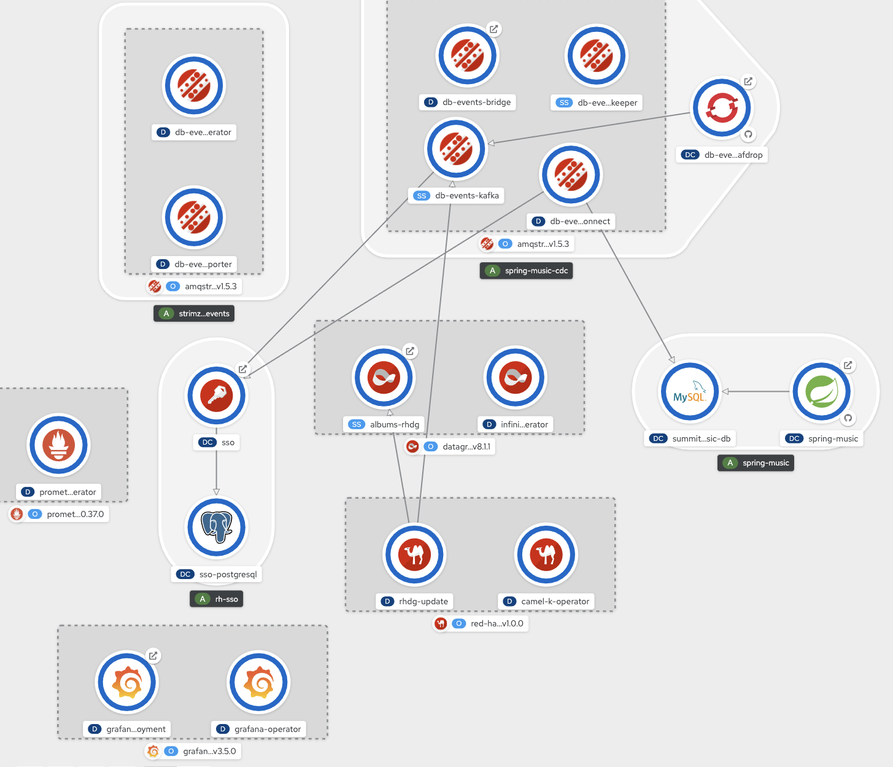

# Table of Contents

- [Info](#info)
- [Assumptions / Requirements](#assumptions--requirements)
- [Deployed Resource URLs](#deployed-resource-urls)
- [Running the Playbook](#running-the-playbook)
- [Additional Resources](#additional-resources)
- [Backlog for enhancements](#backlog-for-enhancements)
  - PRs welcome!

## Info

Ansible playbook for provisioning a [Debezium](https://debezium.io) demo using my [Summit Lab Spring Music application](https://github.com/edeandrea/summit-lab-spring-music/tree/pipeline) as the "monolith". The [Debezium connector](roles/Demo/objects/debezium-connector-config.json) is configured to use the [Outbox Event Router](https://debezium.io/documentation/reference/1.0/configuration/outbox-event-router.html).

The [application](https://github.com/edeandrea/summit-lab-spring-music/tree/pipeline) is a simple Spring Boot application connected to a MySQL database. We'll install a 3 replica Kafka cluster with Kafka connect and then install the [Debezium MySQL connector](https://debezium.io/documentation/reference/1.0/connectors/mysql.html).

Once the events get into Kafka, a [camel-k application](roles/Demo/objects/camelk-client.yml) runs and updates a Red Hat Data Grid cache according to contents from the event (`ALBUM_CREATED`/`ALBUM_UPDATED`/`ALBUM_DELETED`).

The database credentials are stored in a `Secret` and then [mounted into the Kafka Connect cluster](https://strimzi.io/docs/latest/#proc-kafka-connect-mounting-volumes-deployment-configuration-kafka-connect).

The Kafka Broker, [Kafka Connect](https://access.redhat.com/documentation/en-us/red_hat_amq/7.5/html-single/using_amq_streams_on_openshift/index#kafka-connect-str), and [Kafka Bridge](https://access.redhat.com/documentation/en-us/red_hat_amq/7.5/html-single/using_amq_streams_on_openshift/index#kafka-bridge-concepts-str) are all [authenticated via OAuth 2.0](https://access.redhat.com/documentation/en-us/red_hat_amq/7.5/html-single/using_amq_streams_on_openshift/index#assembly-oauth-str). [Red Hat Single Sign-on](https://access.redhat.com/documentation/en-us/red_hat_single_sign-on/7.3) is installed and used as the authorization server. A new realm is automatically created and provisioned.

All metrics are captures by Prometheus and there are Grafana dashboards for Kafka, Zookeeper, and the caches.

Once completed, the resulting output of everything in the OpenShift Topology view should look something like



## Assumptions / Requirements

1. The OpenShift `sso74-postgresql-persistent` template is installed in the `openshift` namespace
1. OperatorHub is available with the following operators available
    - [AMQ Streams](https://access.redhat.com/documentation/en-us/red_hat_amq/7.6/html-single/using_amq_streams_on_openshift/index#key-features-operators_str)
    - [OpenShift Serverless](https://access.redhat.com/documentation/en-us/openshift_container_platform/4.5/html-single/serverless_applications/index#serverless-getting-started)
    - [OpenShift Container Security](https://github.com/quay/container-security-operator)
    - [Red Hat Data Grid](https://access.redhat.com/documentation/en-us/red_hat_data_grid/8.1/html-single/running_data_grid_on_openshift/index#installation)
    - [Camel K](https://access.redhat.com/documentation/en-us/red_hat_integration/2020-q2/html-single/deploying_camel_k_integrations_on_openshift/index#installing-camel-k-operatorhub)
    - [Prometheus](https://operatorhub.io/operator/prometheus)
    - [Grafana](https://operatorhub.io/operator/grafana-operator)
1. The `openssl` utility is installed
1. The `keytool` utility is installed

## Deployed Resource URLs

All the below resource URLs are suffixed with the apps url of the cluster (i.e. for an RHPDS environment, `apps.cluster-##GUID##.##GUID##.example.opentlc.com`).

- OpenShift Console
  - https://console-openshift-console.##CLUSTER_SUFFIX##/k8s/cluster/projects/demo
- [Kafdrop](https://github.com/obsidiandynamics/kafdrop)
  - http://kafdrop-demo.##CLUSTER_SUFFIX##
- [Demo App](https://github.com/edeandrea/summit-lab-spring-music/tree/pipeline)
  - http://spring-music-demo.##CLUSTER_SUFFIX##
- Red Hat Single Sign-on
  - https://secure-sso-demo.##CLUSTER_SUFFIX##
- Prometheus
  - http://prometheus-demo.##CLUSTER_SUFFIX##
- Grafana
  - http://grafana-route-demo.##CLUSTER_SUFFIX##
- [Red Hat Data Grid](https://www.redhat.com/en/technologies/jboss-middleware/data-grid) Console
  - https://albums-rhdg-external-demo.##CLUSTER_SUFFIX##
  - Username: `developer`
  - Password: `developer`

## Running the playbook

To run this you would do something like

```bash
$ ansible-playbook -v main.yml -e ocp_api_url=<OCP_API_URL> -e ocp_admin_pwd=<OCP_ADMIN_USER_PASSWORD>
```

You'll need to replace the following variables with appropriate values:

| Variable | Description |
| -------- | ----------- |
| `<OCP_API_URL>` | API url of your cluster |
| `<OCP_ADMIN_USER_PASSWORD>` | Password for the OCP admin account |

This playbook also makes some assumptions about some things within the cluster. The biggest assumption is that the playbook is installing everything into an empty cluster. The following variables can be overridden with the `-e` switch when running the playbook to customize some of the installation locations and configuration.

| Description | Variable | Default Value |
| ----------- | -------- | ------------- |
| OpenShift admin user name | `ocp_admin` | `opentlc-mgr` |
| OCP user to install demo into | `ocp_proj_user` | `user1` |
| OCP user password for above user | `ocp_proj_user_pwd` | `openshift` |
| Project name to install demo into | `proj_nm_demo` | `demo` |
| Project name to install _ALL_ global operators into | `proj_nm_rh_operators` | `openshift-operators` |
| Project name to install AMQ Streams operator into | `proj_nm_amq_streams_operator` | `{{ proj_nm_rh_operators }}` |
| Project name to install Container Security operator into | `proj_nm_container_security_operator` | `{{ proj_nm_rh_operators }}` |
| Project name to install Serverless operator into | `proj_nm_serverless_operator` | `{{ proj_nm_rh_operators }}` |

## Additional Resources

- [MySQL Database Template](https://github.com/edeandrea/summit-lab-spring-music/blob/pipeline/misc/templates/prod-template-ocp4.yml)
- [AMQ Streams Template](roles/Demo/templates/amq-streams-template.yml.j2)
  - Includes `Kafka`, `KafkaConnect`, `KafkaConnector`, and `KafkaBridge` custom resources
- [Kafdrop Template](roles/Demo/objects/kafdrop.yml)
- [Red Hat SSO Realm Config](roles/Demo/objects/spring-music-cdc-realm.json)
- [Red Hat Data Grid Config](roles/Demo/objects/rhdg.yml)
- [Camel K Config](roles/Demo/objects/camelk-client.yml)
- [Guide used](https://github.com/sigreen/amq-streams-oauth-ldap) for help in setting this all up
  - Thanks @sigreen!

## Backlog for enhancements

PRs welcome!

- [Enabling schema registry and using AVRO serializtion/deserialization](https://github.com/edeandrea/debezium-demo-apb/issues/1)
- [Add authorization on the topics to the different clients](https://github.com/edeandrea/debezium-demo-apb/issues/6)
- [Getting Kafdrop to authenticate with the broker](https://github.com/edeandrea/debezium-demo-apb/issues/7)
  - This will allow removal of the `plain` listener on the broker
- [Integrate the `KafkaBridge` with something (3scale?)](https://github.com/edeandrea/debezium-demo-apb/issues/8)
- [Build some kind of consumer(s) to read the messages & do something with them](https://github.com/edeandrea/debezium-demo-apb/issues/9)
    - Currently there is a Red Hat Data Grid cache that gets updated by a Camel-K application. I'd like to build another application that uses the cache data in some way.
